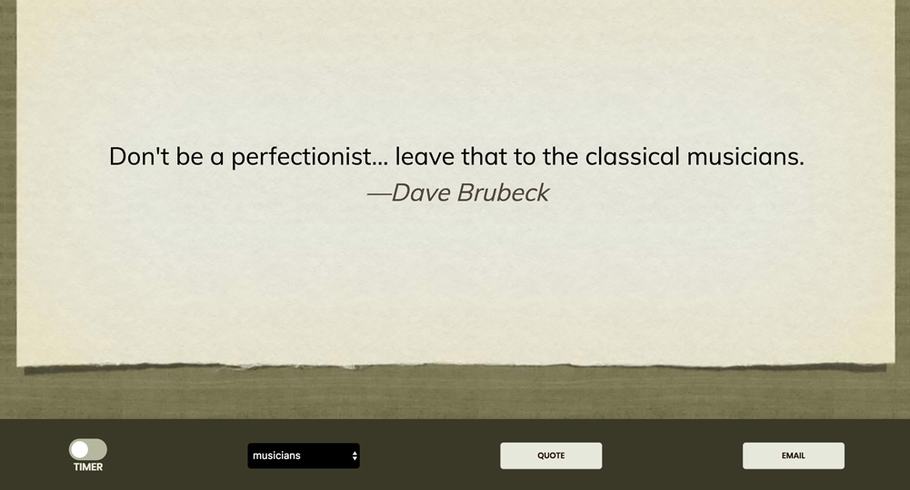

## You Don't Say!
##### Famous quotes by Earthlings...
Created by Steve Hanlon December 2017 as part of the the [freecodecamp.org](www.freecodecamp.org) curriculum.  

#### SUMMARY
The objective is to make a **Quote Machine** that picks and shows a random quote on the DOM.  My example uses an object with "storage" arrays to allow a user to pick quotes by categories, such as quotes by "musicians" or by "philosophers," etc.  I've also included the ability to eMail a quote using the user's mail client. The user can advance through the quotes either by clicking a button or via a timer which automatically advances to the next quote after some time.

#### FUNCTIONALITY
I've used JavaScript ES6 with Babel preprocessor as well jQuery for event handling.  

The architecture is set up  this way:

- Object to hold quote categories stored in arrays

- Empty "quoteStage" array which accepts quotes from the categories and acts as a **Stage** or "the side part of a stage hidden behind the side curtain" but ready to go on stage at any time.

- Several functions to handle:
   1. __*Selecting quote category*__ from menu then filling up quoteStage array
   2. __*Removing a shown quote*__ from quoteStage array
   3. __*Clearing out present quotes*__ when a new quote category is selected
   4. __*Recycling of current quote category*__ once all of the quotes have been seen in that category so there is no interruption or empty screen
   5. __*Formatting and Showing the quote*__ using jQuery's .html()
   6. __*Advancing to next quote by click*__ of the Quote button
   7. __*Advancing automatically to next quote by Timer*__ using a "slider"
   8. __*Emailing the current showing quote*__ using a mail client
   9. __*Showing opening instructions*__ with IIFE so that's the first thing showing on screen

#### STYLING
I used CSS with Flexbox for the styling and layout with CSS animation for the quote transitions.
Background images was gotten from [Apple's Keynote](https://www.apple.com/keynote/) stock background images.

#### Future Features
1. Refactor for MVC so users can enter their own quotes and store them in current categories or make in new categories.
2. Allow users to mark their favorites which are stored in a **Favorites** category
3. Allow customization of background image
4. Allow customization of font and font color
