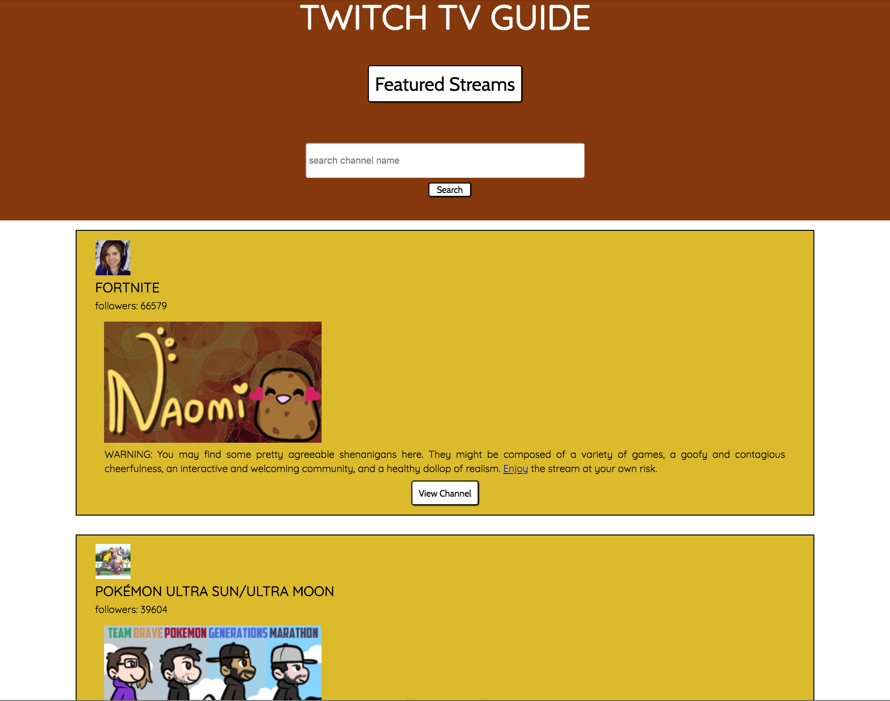

March 11, 2018
Steve Hanlon

Objective: make an API-based app that connects to TwitchTV, retrieves some featured channels, displays a picture of the channels as well as short descriptions with links to the streaming programs"

- The first API call will fetch 25 featured channels on TwitchTV. The channels will be grouped below with icon, channel name, picture, description and direct link button to the channel.

- The second API call will fetch a channel based on the search term in the input field.

